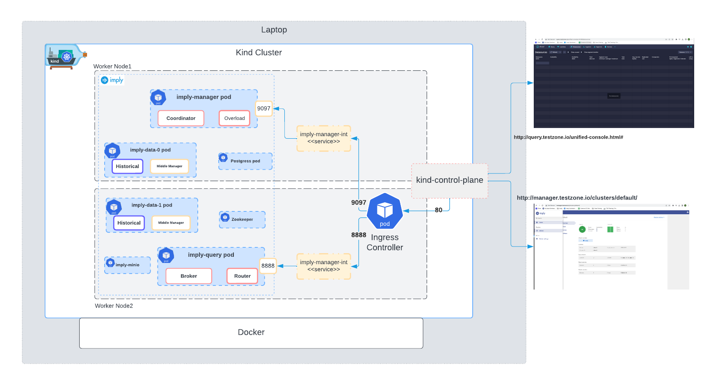

# Deploy Imply Enterprise on Kubernetes on Mac with Postgress  
 
# Introduction

This repo is for deploying Imply Enterprise on your mac/linux laptop using Kind Kubernetes. The diagram below shows how the pods are deployed. Since this is a development setup, we will use only a single pod for each service. For production, the setup will look different. We are also using an NGINX ingress controller to connect to the Imply Manager and Druid console. Also the default implementation uses mysql for metadata. we will use postgress for store metadata. 




## Prerequisite

Its important to install follow applicatons on your mac or linux machine before starting. 

* Install [docker](https://docs.docker.com/desktop/install/mac-install/)
* Install [kind](https://kind.sigs.k8s.io/docs/user/quick-start/#installation)
* Install [Helm](https://helm.sh/docs/intro/install/)
* Install [kubectl](https://kubernetes.io/docs/tasks/tools/install-kubectl-macos/)
    

## Clone repo 

Clone the repo and run all the commands from the root of the folder.

```
git clone https://github.com/mussa-shirazi-imply/imply-kubernetes.git
```

## Type of Deployments 

There are two way you can deploy the running Cluster, Make using the `make` 


 ## Step 1 : Create Kind cluster

Create the cluster using the default cluster name kind. For more information on how to install the Kind application on your laptop, check the [Kind Quick Start guide](https://kind.sigs.k8s.io/docs/user/quick-start/) 

```
kind create cluster --config kind-cluster/kube-demo-cluster.yaml
```

The output should look like below 

```
Creating cluster "kind" ...
 ✓ Ensuring node image (kindest/node:v1.26.3) 🖼
 ✓ Preparing nodes 📦 📦 📦
 ✓ Writing configuration 📜
 ✓ Starting control-plane 🕹️
 ✓ Installing CNI 🔌
 ✓ Installing StorageClass 💾
 ✓ Joining worker nodes 🚜
Set kubectl context to "kind-kind"
You can now use your cluster with:

kubectl cluster-info --context kind-kind

Thanks for using kind! 😊

```

#### Check Cluster nodes

```
kubectl get nodes
```

The output should look like below:

```
NAME                 STATUS   ROLES           AGE     VERSION
kind-control-plane   Ready    control-plane   2m33s   v1.26.3
kind-worker          Ready    <none>          2m14s   v1.26.3
kind-worker2         Ready    <none>          2m14s   v1.26.3

```


## Step 2: Create NGINX ingress controller

Apply the following command to deploy the NGINX Ingress controller:


```
kubectl apply -f https://raw.githubusercontent.com/kubernetes/ingress-nginx/main/deploy/static/provider/kind/deploy.yaml
```

You need to wait a minute or two for the pod `ingress-nginx-controller-` to come up in the `ingress-nginx` namespace. You may have different pod name as kubernetes deployment have dynamic name.

```
kubectl get pods -n ingress-nginx
```

```
NAME                                        READY   STATUS      RESTARTS   AGE
ingress-nginx-controller-6bdf7bdbdd-vmjsr   1/1     Running     0          3m4s
```

## Step3:  Deplay `postgressql`


PostgreSQL is used to store metadata information about the Druid cluster. It is essential to have a running pod for `PostgreSQL`.

### apply the config map file `postgres-config.yaml`

The config map file `postgres-config.yaml` is located in the ./postgresql folder. You can review it for more detail. The config map is used to store the username and password for PostgreSQL


```
kubectl apply -f postgressql/postgres-config.yaml
```

Confirm the config map is applied:


```
kubectl get configmap
```
the output should look like below 

```
NAME               DATA   AGE
kube-root-ca.crt   1      3m5s
postgres-config    3      10s
```

### create persistent volume file `postgres-pvc-pv.yaml`

Create the persistent volume claim for PostgreSQL. To review the file, look for the file `postgres-pvc-pv.yaml` in the `postgresql` folder. Since this is a development environment, we are going to use 1GB storage.

For more detail on persistent volumes and persistent volume claims, visit the [Kubernetes documentation](https://kubernetes.io/docs/concepts/storage/persistent-volumes).


```
kubectl apply -f postgressql/postgres-pvc-pv.yaml
```

Confirm the PV and PVC is deployed


### confirm the pv and pvc is deployed

```
kubectl get pv
```

Output should look like below 

```
NAME                 CAPACITY   ACCESS MODES   RECLAIM POLICY   STATUS   CLAIM                       STORAGECLASS   REASON   AGE
postgres-pv-volume   1Gi        RWX            Retain           Bound    default/postgres-pv-claim   manual                  28s

```

Confirm the PVC is installed

```
kubectl get pvc
```

Output should look like below 

```
NAME                STATUS   VOLUME               CAPACITY   ACCESS MODES   STORAGECLASS   AGE
postgres-pv-claim   Bound    postgres-pv-volume   1Gi        RWX            manual         17s

```


### deploy postgress deployment file `postgres-deployment.yaml`

Create and review the `postgres-deployment.yaml` file in the `./postgressql` folder. The file will deploy a single PostgreSQL pod running on port `5432`. It uses the config map we created `postgres-config` earlier to fetch environment variables and the persistent volume claim `postgres-pv-claim` we created earlier to store data.


```
kubectl apply -f postgressql/postgres-deployment.yaml

```

Check the pods:


```
kubectl get pods
```

```
NAME                       READY   STATUS    RESTARTS   AGE
postgres-7454f995b-hzsjs   1/1     Running   0          29s

```

### ceate postgress service `postgres-service.yaml`

In this step, we will create a `PostgreSQL` service. In Kubernetes, a `Service` is a method for exposing a network application that is running as one or more Pods in your cluster. There are different types of services like `ClusterIP, NodePort, LoadBalancer, and Ingress`. More details can be found in this [blog post](`https://medium.com/devops-mojo/). We are going to use `NodePort`. Examine the file `postgres-service.yaml` in the `./postgress` folder.


```
kubectl apply -f postgressql/postgres-service.yaml
```

##### confirm the service is added 

Confirm the service is added:


```
kubectl get services
```

As you can see, port `30151` is added and mapped to the PostgreSQL port `5432`. You may see different port then `30151` becuase node ports are dynamically allocated unless we define statically. 

```
kubectl get service
NAME         TYPE        CLUSTER-IP    EXTERNAL-IP   PORT(S)          AGE
kubernetes   ClusterIP   10.96.0.1     <none>        443/TCP          75m
postgres     NodePort    10.96.49.43   <none>        5432:30151/TCP   14s

```


## Step 4: Create Imply Manager database

### Login postgres pod

Get the PostgreSQL pod name:

```
kubectl get pods
```

```
NAME                       READY   STATUS    RESTARTS   AGE
postgres-7454f995b-trz6f   1/1     Running   0          25m

```

Log in to the PostgreSQL pod (replace `postgres-7454f995b-trz6f` with your own PostgreSQL pod name):

```
kubectl exec -it postgres-7454f995b-trz6f bash
```

From the PostgreSQL pod:


```
psql -h postgres.default.svc.cluster.local -U admin --password postgresdb -p 5432

```

The password from the PostgreSQL config map: `psltest`


```
# Command result:
#Password for user admin:
#psql (10.1)
#Type "help" for help.
#

You should see the shell like below 

#postgresdb=#

```

Execute the following command from the `psql` shell:


```
CREATE DATABASE "imply-manager" WITH OWNER "admin" ENCODING 'UTF8';

```
Check databases using `\l`:

 ```
  
postgresdb=# \l
                                   List of databases
     Name      |  Owner   | Encoding |  Collate   |   Ctype    |   Access privileges
---------------+----------+----------+------------+------------+-----------------------
 imply-manager | admin    | UTF8     | en_US.utf8 | en_US.utf8 |
 postgres      | postgres | UTF8     | en_US.utf8 | en_US.utf8 |
 postgresdb    | postgres | UTF8     | en_US.utf8 | en_US.utf8 |
 template0     | postgres | UTF8     | en_US.utf8 | en_US.utf8 | =c/postgres          +
               |          |          |            |            | postgres=CTc/postgres
 template1     | postgres | UTF8     | en_US.utf8 | en_US.utf8 | =c/postgres          +
               |          |          |            |            | postgres=CTc/postgres
(5 rows)

 ```


 exit from the `psql` pod 

```
use 

 ^Z

and then 

exit

exit

 ```

Make sure you are out of posgress pod shell and back to your cli .


## Step 5: Add the DNS record to the host file 

Add a new DNS record for the command line:

```
sudo vi /etc/hosts

```

Add the following values:


```
127.0.0.1       manager.testzone.io
127.0.0.1       query.testzone.io

```

## Step 6: Imply Helm chart deployment 

Install Helm 3 if you haven't already installed it on your laptop. For more information on how to install Helm, visit [Helm's documentation](https://helm.sh/docs/intro/install/).


### Add imply helm repo

For more info check imply website [here](https://docs.imply.io/latest/k8s-minikube/)

```
helm repo add imply https://static.imply.io/onprem/helm

helm repo update

```

### Pull and update imply chart(Optional) 

The following step is optional since we have already pulled the Imply Helm chart folder and updated the chart. To get the latest chart, go to the imply folder in this repository and run the following command. Then, edit the [values.yaml](https://github.com/mussa-shirazi-imply/imply-kubernetes/blob/f44bf957bca78e6951524b252c3c2a1104cd5495/imply/values.yaml)  file in `./imply`.


```
helm pull imply/imply --untar

```

Disable the MySQL deployment. By default, the Imply Helm chart deploys MySQL. However, since MySQL has some issues with M1 Macs, we updated the [values.yaml](https://github.com/mussa-shirazi-imply/imply-kubernetes/blob/f44bf957bca78e6951524b252c3c2a1104cd5495/imply/values.yaml) to disable MySQL. We will use Postgres, which we deployed in a previous step, for storing Druid metadata. This has already been done in this repository, but you can check the [values.yaml](https://github.com/mussa-shirazi-imply/imply-kubernetes/blob/f44bf957bca78e6951524b252c3c2a1104cd5495/imply/values.yaml).


```
deployments:
  manager: true
  agents: true
  zookeeper: true
  mysql: false
  minio: true


```

Update the [MySQL](https://github.com/mussa-shirazi-imply/imply-kubernetes/blob/f44bf957bca78e6951524b252c3c2a1104cd5495/imply/values.yaml#L55) section with the Postgres configuration. We have already updated this as part of the repository. But in case you pulled the latest repository, you need to update this [section](https://github.com/mussa-shirazi-imply/imply-kubernetes/blob/f44bf957bca78e6951524b252c3c2a1104cd5495/imply/values.yaml#L55).


```
metadataStore:
  type: postgresql
  host: postgres.default.svc.cluster.local
  port: 5432
  user: admin
  password: psltest
  database: imply-manager
  # tlsCert: |
  #   -----BEGIN CERTIFICATE-----
  #   ...
  #   -----END CERTIFICATE-----

```

### Deploy imply chart

Use the following command in the command line to deploy the Imply chart. Make sure to use the `./imply` folder, which contains the updated values from the previous step.


```
helm install imply ./imply

```

Wait for 2 to 4 minutes for pods to deploy.


### Confirm the imply pods are deployed.

Make sure you have the [Kubectl](https://kubernetes.io/docs/tasks/tools/install-kubectl-macos/) utility installed on your Mac. Use the following command to confirm the chart is deployed:

Confirm the pods are deployed

```
kubectl get pods
```


```
NAME                             READY   STATUS    RESTARTS   AGE
imply-data-0                     0/1     Running   0          2m39s
imply-data-1                     0/1     Running   0          2m39s
imply-manager-78f8654b4b-srb4t   1/1     Running   0          2m39s
imply-master-7c69ff8d4-9vvfc     0/1     Running   0          2m39s
imply-minio-7547bd8466-mxmsd     1/1     Running   0          2m39s
imply-query-d966fb766-h5xk5      0/1     Running   0          2m39s
imply-zookeeper-0                1/1     Running   0          2m39s
postgres-7454f995b-9gh2z         1/1     Running   0          6m24s
```


> **Note**
>Don't worry if you see some pods are not fully up and show similar output. In this step, make sure the `zookeeper`, `manager`, and `master` pods are up and proceed to the next step.

 
## Step 7 : Ingress Controller

Deploy the ingress controller configs located in the `./ngix-controller` folder. As part of the configuration, we will map the URL `manager.testzone.io` with `imply-manager-int`, meaning this URL will open the Imply Manager. The configs also map `query.testzone.io` with the `imply-query` service, meaning this URL will open the Druid console when all the services are implemented.


```
kubectl apply -f ngix-controller/ingress.yaml
```

Check the ingress is deployed 


```
kubectl get ingress
```
Output should like below 

```
NAME            CLASS    HOSTS                                   ADDRESS   PORTS   AGE
nginx-ingress   <none>   manager.testzone.io,query.testzone.io             80      13s
```

The deployment view should look like the following:


Network view 


## Step 8 : Change default cluster configuration and start cluster on imply manager

Open the following URL in your browser: http://manager.testzone.io

You will be presented with below page. Enter all the details. The information is stored on the local DB. 

> **Note**
> I encountered an issue in this step while creating a user ID when I immediately started creating a user right after the previous step. It's best to wait for 5 minutes before adding the details. I used the following ID details for testing. For production use, make sure to employ appropriate credentials and configurations.

```
firstname : test
last: cluster
userid: testid
password : implytest

```


You should be presented with following screen. Dont worry about Critical status for now . click on the `Manage` button


Go to `Setup` page and Change the metadata storage setting to use the PostgreSQL instance deployed earlier.


```
Type: postgresql

Schema : druid_ref

Host: postgres.default.svc.cluster.local

port: 5432

User : admin

password: psltest

```

as shown in the screenshot below . After making the chage , `click` apply changes


on the screen below click `Accept` 


Click Start to Start the cluster 


After 5 minutes you should see the cluster up and running 


If everything goes well, all pods should be running, as shown in the step below.


## Step 9 : Confirm All the pods are up and you are able to access Druid console

Use the `kubectl get pods` command to confirm all the pods are up, and the output should look as follows:


```
NAME                             READY   STATUS    RESTARTS      AGE
imply-data-0                     1/1     Running   0             16h
imply-data-1                     1/1     Running   0             16h
imply-manager-78f8654b4b-jz5gm   1/1     Running   0             16h
imply-master-7c69ff8d4-62qjd     1/1     Running   1 (16h ago)   16h
imply-minio-5d85c84dc4-px8w5     1/1     Running   0             16h
imply-query-d966fb766-dbw8n      1/1     Running   0             16h
imply-zookeeper-0                1/1     Running   0             16h
postgres-7454f995b-hzsjs         1/1     Running   0             16h

```

open the browser url to access http://query.testzone.io/ . This should open Druid console 


## Access Postgres : 

To Access Postgress and look at the meta table use the port-forward


```
kubectl port-forward svc/postgres 5432:5432

```